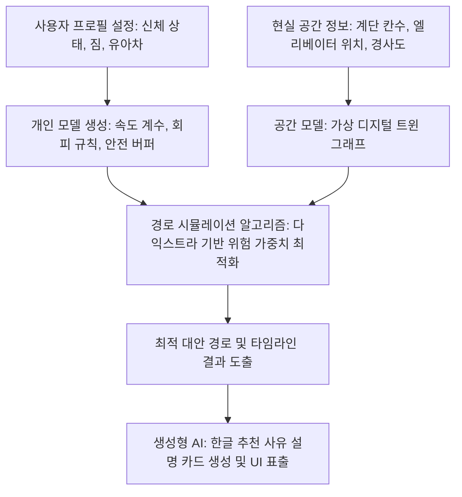

#  AI가 대신 갑니다 (Inclusive AI Digital Twin)

> **"사용자의 몸 상태를 반영해서 목적지까지 먼저 가보는 접근성 이동 디지털 트윈"**

[](#)
[](#)
[](#)

---

## 프로젝트 개요

* **공모 주제**: Inclusive AI (포용적 AI)
* **프로젝트 유형**: AI, Digital Twin, Mobility
* **한 줄 소개**: 사용자의 당일 신체 조건 및 이동 제약을 반영하여 목적지까지 최적의 접근성 경로를 시뮬레이션하는 서비스입니다.
* **실증 범위**: 한신대학교 캠퍼스 경삼관 (검증 가능한 데모 구역)

---

## 기획 의도 및 문제 정의

### 1. '거리/시간' 중심 길찾기의 한계
기존의 상용 길찾기 서비스는 오직 '물리적 최단 거리'와 '최소 소요 시간'만을 기준으로 작동합니다. 그러나 이동 약자(휠체어/유아차 사용자, 고령자, 부상자 등)에게는 계단이나 엘리베이터의 유무, 보도 경사도, 신호등 대기 시간 등 **"실제 이동 가능 여부"**를 결정하는 세부 접근성 정보가 생존과 직결됩니다.

### 2. 누구나 언제든 겪을 수 있는 '이동 제약'
본 프로젝트는 이동 약자를 특수한 '예외'로 처리하지 않습니다. 노인과 영유아, 장애인뿐만 아니라 발목 부상을 입은 학생, 무거운 짐을 든 사람, 유아차를 동반한 부모 등 **누구나 일상에서 일시적으로 이동 약자가 될 수 있다**는 보편적 시각에서 출발합니다.

### 3. 먼저 경험하고 안내하는 AI 디지털 트윈
사용자의 '오늘 신체 상태'와 '이동 속도'를 가상 디지털 트윈 공간에 복제하여, AI가 먼저 경로를 시뮬레이션합니다. 안전하고 실행 가능한 대안 경로, 적정 안전 마진(Buffer)이 반영된 권장 출발 시각, 경로 상의 주의 지점을 선제적으로 제시합니다.

---

## 핵심 기능 (UX)

| 기능명 | 주요 특징 및 시각화 내용 |
| :--- | :--- |
| **프로필 맞춤형 시뮬레이션** | - 휠체어, 목발, 무거운 짐, 유아차 등 사용자 상태별 속도 계수 반영<br>- 계단 회피, 완만한 경사 선호 등 회피/주의/허용 필터링 조건 제공 |
| **"AI가 먼저 다녀왔어요" 결과 카드** | - 안전 버퍼(Buffer)가 자동 적용된 권장 출발/도착 시각 산출<br>- 총 소요 시간, 직관적인 경로 안전 등급 및 불확실성 지표 표시 |
| **구간별 상세 타임라인** | - 출발지부터 경사로, 문 형태, 엘리베이터 탑승, 횡단보도 진입 등을 시간 순으로 표시<br>- 층간 수직 이동 상태(엘리베이터 오름/내림, 계단 오름/내림) 연동 표출 |
| **생성형 AI 추천 사유 설명** | - 단순 수치 비교 대신 "계단 0개, 평지 보행 300m 감소" 등 이해하기 쉬운 한국어 설명 자동 생성<br>- 대안 경로별 트레이드오프 분석 제공 ("A경로는 빠르나 정보 불확실, B경로는 느리지만 계단 없음") |
| **데이터 신뢰도 및 크라우드 피드백** | - 정보가 갱신되지 않은 구역에 대해 주의 경고 메시지 표출<br>- 사용자가 "공사 중", "장애물 발생" 피드백 제공 시 다음 경로 탐색에 페널티 실시간 반영 |

---

## 기술 설계 및 아키텍처



### 1. 공간 모델 (디지털 트윈)
* 현실의 물리적 공간 제약 요소를 가상에 정밀 복제합니다.
* 장소(노드)와 이동 구간(엣지)으로 구성된 그래프 데이터 구조 위에 **계단 칸수, 도어 타입, 턱 높이, 외부보행로 속성** 등의 세부 접근성 속성을 부여합니다.

### 2. 개인 모델 (Personal Model)
* "평균 사용자" 프레임에서 벗어나 "나"의 상태를 정의합니다.
* 프로필 조건에 맞춰 고유 속도 계수, 특정 노드 회피 규칙(예: 유아차/휠체어 시 계단 간선 완전 배제), 보행 안전 마진 버퍼를 실시간 적용합니다.

### 3. 시뮬레이션 로직 및 가중치 공식
다익스트라(Dijkstra) 알고리즘을 기반으로 맞춤형 위험 비용(Cost) 평점을 산출하여 경로를 선별합니다.
$$\text{경로 가중치(Cost)} = \text{개인화 이동 시간} + \text{계단 페널티} + \text{위험 요소 페널티} + \text{데이터 불확실성 페널티}$$
* **편하게 모드(Comfortable)** 선택 시: 계단 및 위험 보행로의 페널티 상수를 수천 배 이상 극단적으로 상향하고, 구름다리 $\rightarrow$ 엘리베이터 연계 복도의 우선순위를 강제 제어해 배리어 프리(Barrier-Free) 경로를 보장합니다.

---

## 팀원 역할 및 파트 분배

프로젝트는 총 2명의 팀원으로 구성되어 협력 개발을 진행했습니다.

| 이름 | 담당 파트 | 주요 역할 및 세부 업무 |
| :--- | :--- | :--- |
| **반재민** | **백엔드 & 데이터 시뮬레이션**<br>*(Leader)* | - **시스템 구조 설계 및 알고리즘 구현**: 현장 수집 엑셀 데이터 가공 및 관계형 ERD 설계<br>- **경로 가중치 엔진 구축**: 파이썬(`NetworkX`)을 활용하여 사용자 유형 및 편하게/빠르게 옵션별 정밀 페널티 점수 산출 로직 설계<br>- 최종 코드 통합 및 최적화, 학술 논문 작성 주도 |
| **최우리** | **프론트엔드 & 생성형 AI** | - **사용자 경험(UX) UI 개발**: React를 사용해 신체 제약 프로필 필터링 패널 및 단계별 이동 타임라인 반응형 화면 구축<br>- **설명 가능한 AI 연동**: 백엔드 알고리즘 경로 데이터를 파싱하여 생성형 AI API를 통한 맞춤형 한글 설명 도출<br>- 발표 PPT 제작 및 비주얼 디자인 총괄 |
| **공통** | **현장 실사 & 기획** | - **실제 건물 계측**: 경삼관 외부 경사로 및 층간 계단 칸수 직접 실측 및 데이터화<br>- 모바일 센서를 이용한 조도, 장애물 기록 및 데모 시나리오 최종 설계 |

---

## 🚀 시작 가이드

### 백엔드 (API Server)
```bash
# 가상환경 구축 및 패키지 설치
uv venv .venv
.venv\Scripts\activate
uv pip install -r requirements.txt

# API 서버 실행
python src/api_server.py
```

### 프론트엔드 (Vite React Client)
```bash
# 종속성 라이브러리 설치
npm install

# 로컬 개발 개발 서버 기동
npm run dev
```
* 웹 브라우저에서 `http://localhost:5173/`에 접속하여 개인화 시뮬레이터를 실행하실 수 있습니다.
